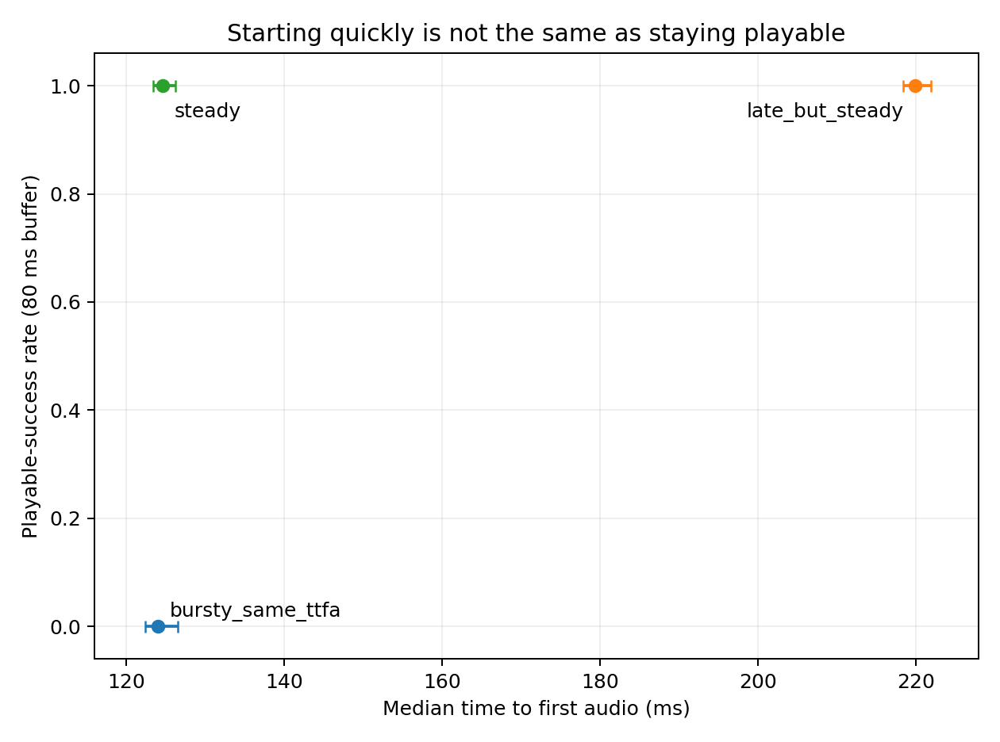
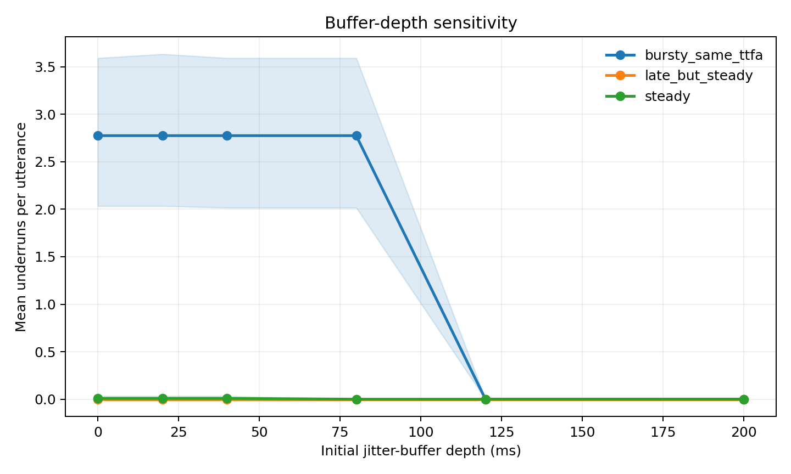

# Voice Stream SLO Lab

**Time to first audio tells you when speech starts. It does not tell you whether the rest of the utterance stays playable.**

This repository benchmarks the client-visible delivery path of streaming text-to-speech systems. It records every playable PCM receive event, converts bytes into media time, and replays the trace through configurable jitter buffers. The goal is a reproducible answer to a production question: *would a voice agent glitch after it started talking?*

The project is provider-neutral. The live protocol covers four low-latency, agent-oriented offerings using the same 24 kHz, 16-bit, mono PCM boundary:

| Provider | Pinned model | Transport |
|---|---|---|
| Cartesia | `sonic-3.5-2026-05-04` | persistent WebSocket |
| Deepgram | `flux-haley-en` | persistent WebSocket |
| ElevenLabs | `eleven_flash_v2_5` | chunked HTTP |
| OpenAI | `gpt-4o-mini-tts` | chunked HTTP |

Model choice is declared rather than presented as a permanent ranking. Provider APIs and aliases change; every published run includes its exact configuration and UTC collection window.

## What it measures

- **Time to first audio (TTFA):** request send to the first playable PCM bytes.
- **Inter-chunk arrival distribution:** raw receive gaps, plus *pacing error*—arrival gap minus the playable duration of the preceding chunk.
- **Delivery real-time factor:** elapsed delivery time divided by cumulative playable audio, both at each prefix and for the full utterance.
- **Underruns by buffer depth:** starvation events at 0, 20, 40, 80, 120, and 200 ms of initial buffering.
- **Recovery behavior:** time from buffer starvation until the next playable chunk arrives.
- **Playable-success rate:** the request succeeds and has zero underruns at the declared buffer depth. Failed requests count as broken playback.
- **Controlled pause survival:** whether the recorded delivery remains playable after the same one-off downstream receive pause is injected at multiple utterance positions.

See the exact definitions and simulator state machine in [the methodology](docs/methodology.md).

## Why TTFA is insufficient

The checked-in synthetic validation contains a steady stream and a bursty stream with nearly identical TTFA. Their mid-utterance behavior is deliberately different. This is a test of the instrumentation—not a provider result.





## First live run

The first declared live collection used Cartesia Sonic 3.5, Deepgram Flux, and
ElevenLabs Flash: six prompts × 20 repetitions × three providers, globally
serial and interleaved. All 360 measured requests returned playable PCM.

No provider recorded an underrun in the observed low-load baseline, even with the simulator's
zero-depth target. That is a result, but not a resilience ranking: every captured
stream stayed ahead of playback. The controlled receive-pause replay reveals the
different amounts of headroom without pretending the injected pause was observed
provider behavior.


See the [live report](results/live/2026-08-23-three-provider/analysis/report.md),
the long-form tables, and all 360 receive-event traces. This is one client, one
collection window, six prompts, and low load—not a universal provider ordering.

## Reproduce the metric validation

```bash
python -m pip install -e '.[dev]'
voice-stream-slo demo --output results/synthetic
python -m pytest
```

The synthetic command requires no network access or API keys.

## Run the live benchmark

Copy `.env.example` to the gitignored `.env` file and fill in the providers you
intend to run, or export the same variables in your shell:

```bash
export CARTESIA_API_KEY=...
export DEEPGRAM_API_KEY=...
export ELEVENLABS_API_KEY=...
export OPENAI_API_KEY=...

voice-stream-slo run \
  --config configs/benchmark.json \
  --output results/live/2026-08-west-coast

voice-stream-slo analyze \
  --config configs/benchmark.json \
  --input results/live/2026-08-west-coast/raw/traces \
  --output results/live/2026-08-west-coast/analysis
```

Before a publishable run, replace `network_label` in the config with an honest description of the client and egress location. Never commit API keys. Raw audio is not retained by default; the auditable artifact is arrival time plus PCM byte count for every receive event.

## Protocol in one paragraph

Six fixed English agent utterances span three length bands. Each provider receives the complete text at application request time. Connections are established and warmed with two excluded requests. The measured matrix is globally serial and deterministically interleaved across providers, prompts, and 20 repetitions. TTFA begins immediately before the application payload is sent; DNS, TLS, and WebSocket setup are excluded from TTFA and declared separately. Intervals resample prompts and trials hierarchically; binary-rate intervals also include the Wilson score envelope so all-success samples do not produce false zero-width uncertainty.

When the observed baseline has no underruns, analysis also performs a separately labeled
counterfactual stress replay. It delays the receive-event suffix beginning at 25%, 50%, and
75% of the utterance by declared amounts. This measures how much delivery headroom the
captured stream contained; it is not presented as an observed provider outage.

## Interpretation boundaries

This is a delivery-reliability benchmark, not a voice-quality leaderboard. A single client location cannot establish global performance. HTTP receive chunks can be coalesced by the client stack, while WebSocket message boundaries are explicit; that difference is part of what an application observes and is documented, but it should not be mistaken for model-internal cadence. See [limitations](docs/methodology.md#limitations) and [provider notes](docs/provider_notes.md).

## Repository map

```text
configs/                 declared protocol and model versions
prompts/                 fixed agent-style utterances
src/voice_stream_slo/    adapters, trace schema, simulator, analysis
tests/                   deterministic metric and state-machine tests
docs/                    methodology and provider-specific API notes
results/synthetic/       checked-in instrumentation validation
results/live/            timestamped live traces and analyses
```

Code is MIT licensed. Provider names and trademarks belong to their respective owners. This project is independent and is not endorsed by any provider.
