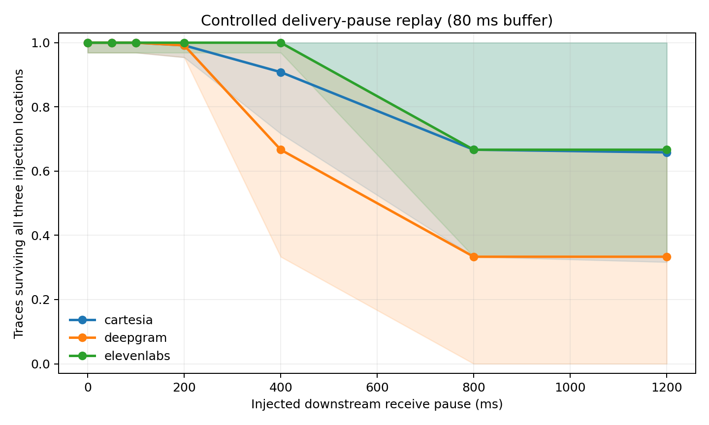
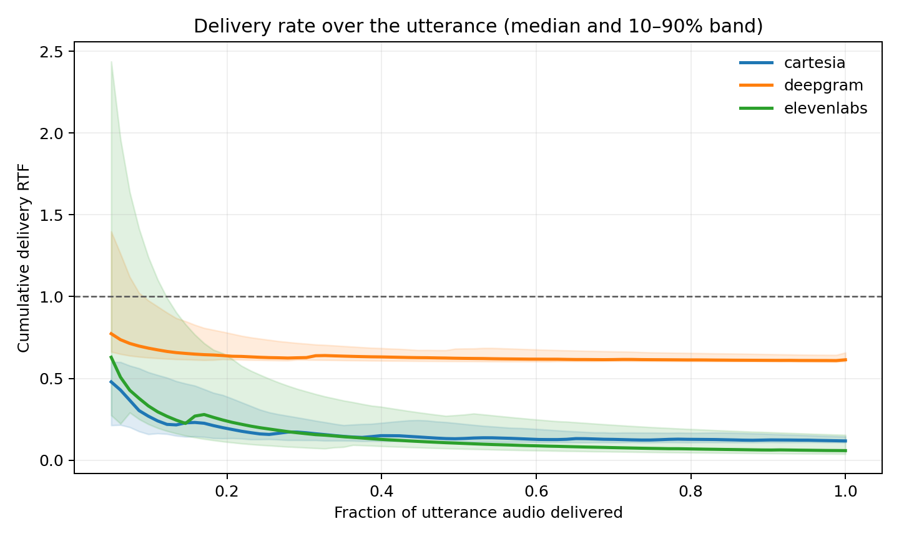

# Voice Stream SLO Lab

A client-side benchmark for streaming TTS delivery. It measures whether audio remains playable after the first bytes arrive, not only time to first audio (TTFA).

## Results

The first live run used six English agent prompts, 20 repetitions, and three providers. Requests were warmed, globally serial, and interleaved. All 360 measured requests returned playable 24 kHz PCM.

| Provider | Median TTFA | Baseline playable success | Median delivery RTF | 400 ms pause survival |
|---|---:|---:|---:|---:|
| Cartesia Sonic 3.5 | 91.4 ms | 100% | 0.118 | 90.8% |
| Deepgram Flux | 93.2 ms | 100% | 0.614 | 66.7% |
| ElevenLabs Flash | 195.2 ms | 100% | 0.059 | 100% |

No provider recorded a baseline underrun at initial buffer targets from 0 to 200 ms. The controlled pause replay is therefore the more discriminating result: it measures how much delivery headroom each recorded stream contained. The pause is injected during replay and is not an observed provider outage.





The [live report](results/live/2026-08-23-three-provider/analysis/report.md) contains confidence intervals and links to the long-form tables. All 360 receive-event traces are checked in under `results/live/`.

## Method

Each adapter returns raw signed 16-bit, 24 kHz, mono PCM. The client records the arrival time and byte count of every playable receive event; raw audio is not retained.

Reported metrics:

- TTFA from request send to first playable PCM
- inter-chunk gaps and pacing error
- cumulative and full-utterance delivery real-time factor
- underrun count and recovery time at 0, 20, 40, 80, 120, and 200 ms buffer targets
- playable-success rate, with failed requests retained in the denominator

The stress replay shifts the receive-event suffix by 0–1,200 ms when cumulative audio crosses 25%, 50%, and 75% of an utterance. A trace passes only if an 80 ms buffer survives all three locations. Continuous metrics use a hierarchical prompt/trial bootstrap; binary-rate intervals include a Wilson-score envelope.

Full definitions are in [methodology](docs/methodology.md). API choices and timing boundaries are documented in [provider notes](docs/provider_notes.md).

## Reproduce

```bash
python -m pip install -e '.[dev]'
voice-stream-slo demo --output results/synthetic
python -m pytest
```

The synthetic validation requires no network access. For a live run, copy `.env.example` to the gitignored `.env`, add the provider keys, set an accurate `network_label` in `configs/benchmark.json`, then run:

```bash
voice-stream-slo run \
  --config configs/benchmark.json \
  --output results/live/my-run

voice-stream-slo analyze \
  --config configs/benchmark.json \
  --input results/live/my-run/raw/traces \
  --output results/live/my-run/analysis
```

Adapters are included for Cartesia Sonic 3.5, Deepgram Flux, ElevenLabs Flash, and OpenAI `gpt-4o-mini-tts`. The published live run used the first three.

## Scope

This is a low-load delivery benchmark from one client location, not a voice-quality evaluation or global provider ranking. HTTP clients may coalesce reads, while WebSockets expose message frames; the benchmark reports the application-visible boundary. See the [limitations](docs/methodology.md#limitations).

Code is MIT licensed. Provider names and trademarks belong to their owners.
